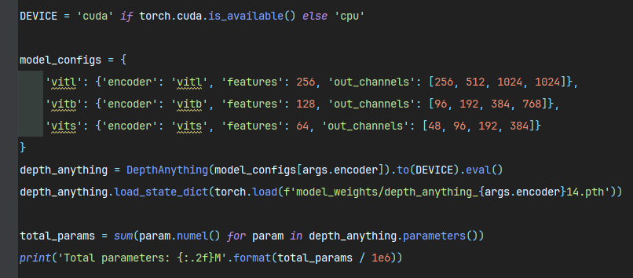
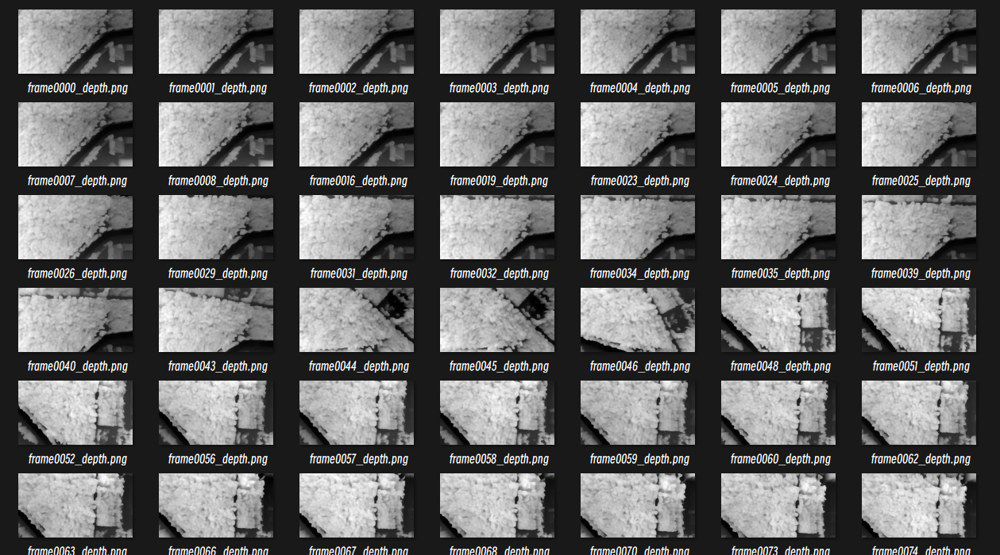
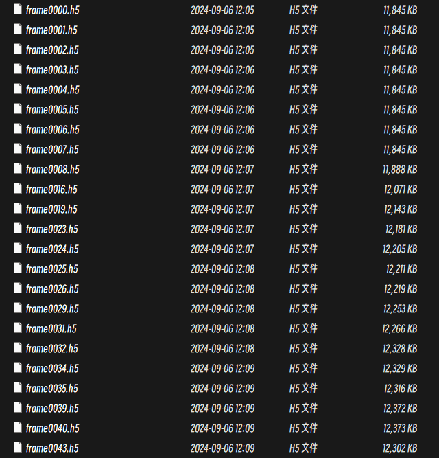
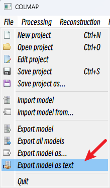
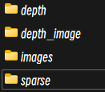
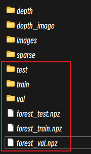
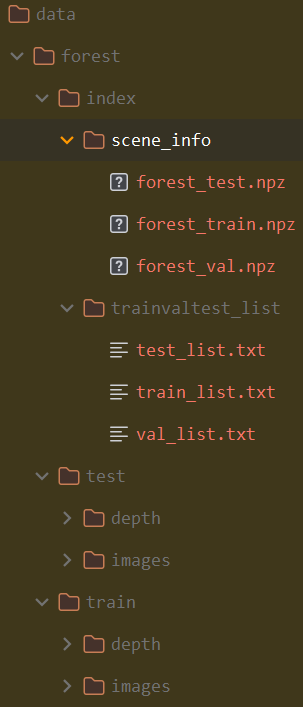
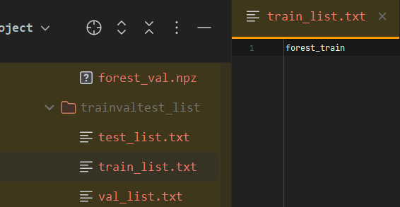

# This repo is creation for training LoFTR on custom dataset

This is the initial LoFTR [README](docs/README.md) file.

As we all know, training LoFTR is not easy, I mean the official dont offer too much info for training our own custom datasets, so I give it a try.

This repo finishs the following things:

- [x] Using Colmap for sparse reconstruction.

- [x] Using Depth-Anything evaluating Depth for each image.

- [x] Convert depth.png to depth.h5 file.

- [x] Convert camera params to .npz file.

- [x] Modify a little code because of the errors in the initial LoFTR.

# Environment
you should follow the README file of LoFTR to prepare the Environment.
```python
conda env create -f environment.yaml
conda activate loftr
pip install -r requirements_loftr.txt
```

`requirements_loftr.txt` is my environment.


# Prepare your own data
## 1.Using Colmap for sparse reconstruction
First of all, you should install [Colmap](https://github.com/colmap/colmap) (best cuda version).

If you have your own COLMAP dataset without undistortion (e.g., using OPENCV camera), you can try to just run the last part of the script: 
Put the images in input and the COLMAP info in a subdirectory distorted:
```
<location>
|---input
|   |---<image 0>
|   |---<image 1>
|   |---...
|---distorted
    |---database.db
    |---sparse
        |---0
            |---...
```
Then run
```python
python convert.py -s <location> [--skip_matching] [--resize] #If not resizing, ImageMagick is not needed
 
# the input dir is in the <location>
```

## 2.Using Depth-Anything evaluating Depth for each image
1. Clone [Depth-Anything](https://github.com/LiheYoung/Depth-Anything) and download pre-trained model [here](https://huggingface.co/spaces/LiheYoung/Depth-Anything/tree/main/checkpoints).
```python
git clone --recursive https://github.com/LiheYoung/Depth-Anything.git
```
2. Modify `run.py` and replace your model path
```python
    model_configs = {
        'vitl': {'encoder': 'vitl', 'features': 256, 'out_channels': [256, 512, 1024, 1024]},
        'vitb': {'encoder': 'vitb', 'features': 128, 'out_channels': [96, 192, 384, 768]},
        'vits': {'encoder': 'vits', 'features': 64, 'out_channels': [48, 96, 192, 384]}
    }
    depth_anything = DepthAnything(model_configs[args.encoder]).to(DEVICE).eval()
    depth_anything.load_state_dict(torch.load(f'model_weights/depth_anything_{args.encoder}14.pth'))  # replace your model path
```


3. Predict Depth map for each image
```python
python run.py --encoder vitl --img-path assets/examples --outdir depth_vis --grayscale --pred-only
# python run.py --encoder vitb --img-path assets/examples --outdir depth_vis --grayscale --pred-only
# python run.py --encoder vits --img-path assets/examples --outdir depth_vis --grayscale --pred-only
```
Then you will get the following results


## 3.Convert depth.png to depth.h5 file
run `generate_train_data/convert_depth_format.py`
```python
python generate_train_data/convert_depth_format.py --image_dir YOUR_IMAGE_DIR_PATH --output_dir YOUR_OUTPUT_DIR_PATH

# dest = f.create_dataset("depth", data=depth, compression='gzip', compression_opts=9)  # small file but slow
# dest = f.create_dataset("depth", data=depth)  # big file but fast
```
Because I use gzip compression for h5 file, It may spend lots of time.

Then you will get



## 4.Convert camera params to .npz file
After the above three steps you can get the following data structure:

First of all, you should convert `cameras.bin images.bin points3D.bin` to `cameras.txt images.txt points3D.txt` by Colmap.



```
<scene>
|---images
|   |---<image 0>
|   |---<image 1>
|   |---...
|---sparse
|    |---0
|       |---cameras.bin
|       |---images.bin
|       |---points3D.bin
|---depth
|   |---image0.h5
|   |---image1.h5
|   |---...
```
as the image showing:



run `generate_train_data/preprocess_scene.py`
```python
python generate_train_data/preprocess_scene.py --base_path YOUR_<scene>_PATH --scene_id YOUR_<scene>_NAME --output_path YOUR_OUTPUT_PATH
```

Then you will get



## 5.Format data structure
you should copy the generated data file to the `LoFTR/data`, and format data structure, as the following shows:





Manually specify the `train, val, test` set in `train_list.txt val_list.txt test_list.txt` file.

This data structure is exactly the same as MegaDepth.

```
<scene>
|---index
|   |---scene_info
|       |---xxx1.npz
|       |---xxx2.npz
|       |---xxx3.npz
|   |---trainvaltest_list
|       |---train_list.txt
|       |---val_list.txt
|       |---test_list.txt
|---test
|    |---depth
|       |---image0.h5
|       |---image1.h5
|       |---...
|   |---images
|       |---image0.png
|       |---image1.png
|       |---...
|---train
|    |---depth
|       |---image0.h5
|       |---image1.h5
|       |---...
|   |---images
|       |---image0.png
|       |---image1.png
|       |---...
```

# 6.Modify Config file
Using the template creating your data config file.

change `YOUR_DATA_SCENE`

```python
from configs.data.base import cfg

TRAIN_BASE_PATH = "data/YOUR_DATA_SCENE/index"
cfg.DATASET.TRAINVAL_DATA_SOURCE = "MegaDepth"
cfg.DATASET.TRAIN_DATA_ROOT = "data/YOUR_DATA_SCENE/train"
cfg.DATASET.TRAIN_NPZ_ROOT = f"{TRAIN_BASE_PATH}/scene_info"
cfg.DATASET.TRAIN_LIST_PATH = f"{TRAIN_BASE_PATH}/trainvaltest_list/train_list.txt"
cfg.DATASET.MIN_OVERLAP_SCORE_TRAIN = 0.0

TEST_BASE_PATH = "data/YOUR_DATA_SCENE/index"
cfg.DATASET.TEST_DATA_SOURCE = "MegaDepth"
cfg.DATASET.VAL_DATA_ROOT = cfg.DATASET.TEST_DATA_ROOT = "data/YOUR_DATA_SCENE/test"
cfg.DATASET.VAL_NPZ_ROOT = cfg.DATASET.TEST_NPZ_ROOT = f"{TEST_BASE_PATH}/scene_info"
cfg.DATASET.VAL_LIST_PATH = cfg.DATASET.TEST_LIST_PATH = f"{TEST_BASE_PATH}/trainvaltest_list/val_list.txt"
cfg.DATASET.MIN_OVERLAP_SCORE_TEST = 0.0   # for both test and val

# 368 scenes in total for MegaDepth
# (with difficulty balanced (further split each scene to 3 sub-scenes))
cfg.TRAINER.N_SAMPLES_PER_SUBSET = 100

cfg.DATASET.MGDPT_IMG_RESIZE = 640  # for training on 11GB mem GPUs
```

Then you could train your own LoFTR model happily!😊